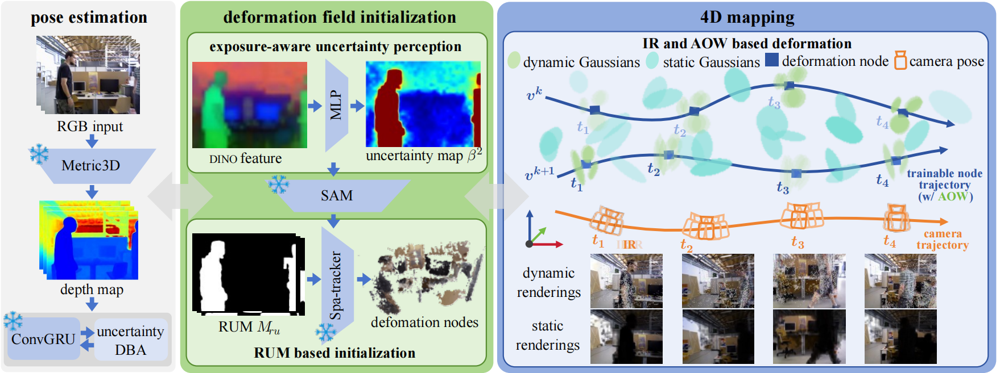
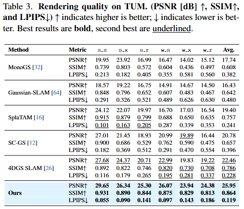
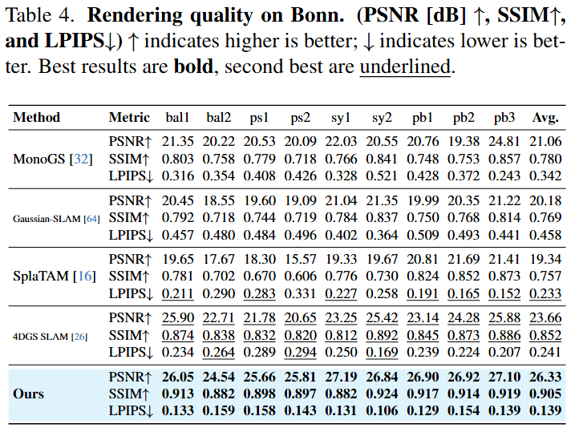
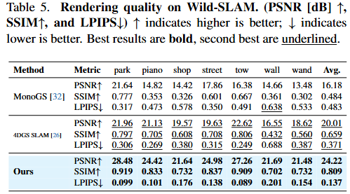
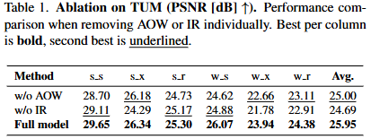
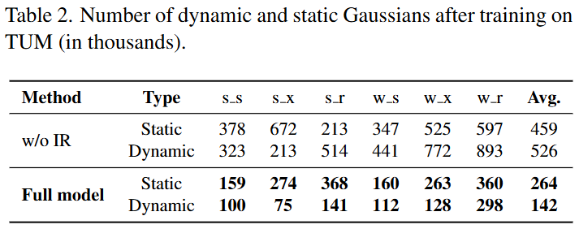

<p align="center">

  <h1 align="center">RU4D-SLAM: Reweighting Uncertainty in Gaussian Splatting SLAM for 4D Scene Reconstruction</h1>
  <p align="center">
    <span class="author-block">
                <a href="FIRST AUTHOR PERSONAL LINK" target="_blank">Yangfan Zhao</a><sup>1*</sup></span>
                <span class="author-block">
                  <a href="https://scholar.google.com/citations?user=7QjjN2wAAAAJ&hl=en" target="_blank">Hanwei Zhang</a><sup>2*</sup></span>
                  <span class="author-block">
                    <a href="THIRD AUTHOR PERSONAL LINK" target="_blank">Ke Huang</a><sup>3</sup>
                  </span>
                  <br>
                  <span class="author-block">
                    <a href="https://scholar.google.com/citations?user=qj66yXAAAAAJ&hl=en" target="_blank">Qiufeng Wang</a><sup>3</sup>
                  </span>
                  <span class="author-block">
                    <a href="THIRD AUTHOR PERSONAL LINK" target="_blank">Zhenzhou Shao</a><sup>1&dagger;</sup>
                  </span>
                  <span class="author-block">
                    <a href="https://scholar.google.com/citations?user=-Ji_VmkAAAAJ&hl=en" target="_blank">Dengyu Wu</a><sup>4&dagger;</sup>
                  </span>
                  <span class="eql-cntrb"><small><br><sup>*</sup>Equal contribution</small><small>&nbsp;&nbsp;&nbsp;&nbsp;<sup>&dagger;</sup>Corresponding Author</small></span>
</p>
<p align="center"> <strong>Computer Vision And Pattern Recognition (CVPR) 2026 Findings Track</strong></p>
  <h3 align="center"><a href="https://arxiv.org/pdf/2602.20807">Paper</a> | <a href="https://github.com/CNU-Bot-Group/ru4dslam">Project Page</a> | <a href="https://arxiv.org/abs/2602.20807">arXiv</a></h3>
  <div align="center"></div>
</p>
<p align="center">
    
</p>
<p style="text-align: justify; max-width: 800px; line-height: 1.5;">
<b>Overview of RU4D-SLAM</b>. 
RU4D-SLAM operates in three stages: pose estimation, deformation field initialization, and 4D mapping, all of which are closely linked to the uncertainty map <i>β²</i>. 
In the pose estimation stage, <i>β²</i> supports uncertainty-aware DBA tracking. 
Before 4D mapping, the uncertainty map is combined with SAM to form RUM, within which deformation nodes are initialized as local motion anchors by a pretrained SpaTracker model.
In 4D mapping, node trajectories are propagated to Gaussians via deformation blending and optimized through IR- and AOW-guided training for joint static and dynamic rendering at each keyframe.
Snowflake icons denote pre-trained, frozen modules.
</p>
<p style="text-align: center; margin-top: 10px;">
</p>
<br>

<p style="text-align: center; margin-top: 10px; font-size: 20px; font-weight: bold;">
<i>Code will be released soon</i>
</p>

## Results

<details>
<summary><font size="4">
TUM Rendering Quality Results
</font></summary>
<div style="text-align: center;">

</div>
</details>

<details>
<summary><font size="4">
Bonn Rendering Quality Results
</font></summary>
<div style="text-align: center;">

</div>
</details>

<details>
<summary><font size="4">
Wild-SLAM Rendering Quality Results
</font></summary>
<div style="text-align: center;">

</div>
</details>

<details>
<summary><font size="4">
Modules Ablation
</font></summary>
<div style="text-align: center;">

</div>
</details>

<details>
<summary><font size="4">
IR Ablation
</font></summary>
<div style="text-align: center;">

</div>
</details>

## Install

1. Simply run the following command. This script assumes you have an Ubuntu environment and Anaconda installed. The Pytorch version used is 2.1.2 and CUDA version is 12.1. You may have to tweak the script to fit your own environment. For the download link of package Pytorch3D in ```install.sh```, please modify refering to [here](https://api.anaconda.org/download/pytorch3d/pytorch3d/) to fit your own environment.
    ```bash
    source install.sh
    ```

2. Download from [here](https://drive.google.com/file/d/15tveiv7ZkvBBAN3qkkB7Zfky9d7vSqLD/view?usp=sharing) some checkpoints for the 2D foundational models if they are not HG downloadables.

    WARNING: By downloading these checkpoints, you must agree and obey the original license from the original authors ([RAFT](https://github.com/princeton-vl/RAFT), [SpaTracker](https://github.com/henry123-boy/SpaTracker), and [TAPNet](https://github.com/google-deepmind/tapnet)). Unzip the weights into the following file structure:
    ```bash
    ProjRoot/weights
    ├── raft_models
    │   ├── raft-things.pth
    │   └── ...
    ├── spaT_final.pth
    └── tapnet
        └── bootstapir_checkpoint_v2.pt
    ```

3. Download the pretained models [droid.pth](https://drive.google.com/file/d/1PpqVt1H4maBa_GbPJp4NwxRsd9jk-elh/view?usp=sharing), put it inside the `pretrained` folder.
   
## Run

You can download the different datasets by the following command. 
```bash
bash scripts_downloading/download_tum.sh
bash scripts_downloading/download_bonn.sh
bash scripts_downloading/download_wild_slam_iphone.sh
```
Then, you can run RU4D-SLAM to test all sequences via the following command:
```bash
bash scripts_run/run_tum_dynamic_all.sh 
bash scripts_run/run_bonn_all.sh
bash scripts_run/run_wild_slam_iphone_all.sh
```

If you want just to run a single sequence, you can run the following commands to run each part of pipelines:
```bash
python run.py  ./configs/Dynamic/TUM_RGBD/{config_file
python run.py  ./configs/Dynamic/Bonn/{config_file}
python run.py  ./configs/Dynamic/Wild_SLAM_Mocap/{config_file} 
python run.py  ./configs/Dynamic/Wild_SLAM_Mocap/{config_file} 
```

## Reproduce the Tables

- Now we provide instructions to reproduce our results for Tab.1 (Dycheck), Tab.2 (Nvidia), and Tab.3 (Tum and Sintel) in the new paper.
- (Option-A) Reproduce by running locally:
    - Download the data from [here](https://drive.google.com/file/d/1sSvVi5Bid_KQsuguVGuqUVgWPzVdb9jM/view?usp=sharing). By downloading the data, you must agree and obey the original license from the original authors ([Dycheck](https://github.com/KAIR-BAIR/dycheck), [Nvidia](https://github.com/gaochen315/DynamicNeRF?tab=readme-ov-file), [TUM](https://cvg.cit.tum.de/rgbd/dataset/), and [Sintel](http://sintel.is.tue.mpg.de/)). Unzip into the following file structure:
    
        ```bash
        ProjRoot/data/iphone
            ├── apple
            ├── ...
            └── wheel
        ```
    
    - Check the script `reproduce.sh`. For example, if you have 1 GPU, just run: 
        ```bash 
        bash reproduce.sh
        ```
        
        If you have multiple GPUs, you can run `bash reproduce.sh #GPU_ID #NUM_OF_TOTAL_DEVICES` in several terminals.
- (Option-B) Reproduce by downloading the checkpoints run by us from [here](https://drive.google.com/drive/folders/14awBsxTmY211ut9SnW5d1vuvVyThYhjl?usp=sharing). Unzip the downloaded subfolders in the same structure as above under `data`.
- Finally, you can collect all the results by checking `collect_metrics.ipynb` to form reports stored in `data/metrics_collected`.

## Citation

If you find our code or paper useful, please cite
```bibtex
@article{zhao2026ru4d,
  title={RU4D-SLAM: Reweighting Uncertainty in Gaussian Splatting SLAM for 4D Scene Reconstruction},
  author={Zhao, Yangfan and Zhang, Hanwei and Huang, Ke and Wang, Qiufeng and Shao, Zhenzhou and Wu, Dengyu},
  journal={arXiv preprint arXiv:2602.20807},
  year={2026},
  url={https://arxiv.org/abs/2602.20807}, 
}
```
